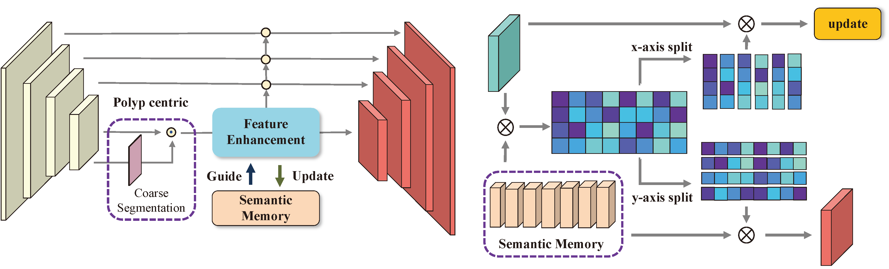
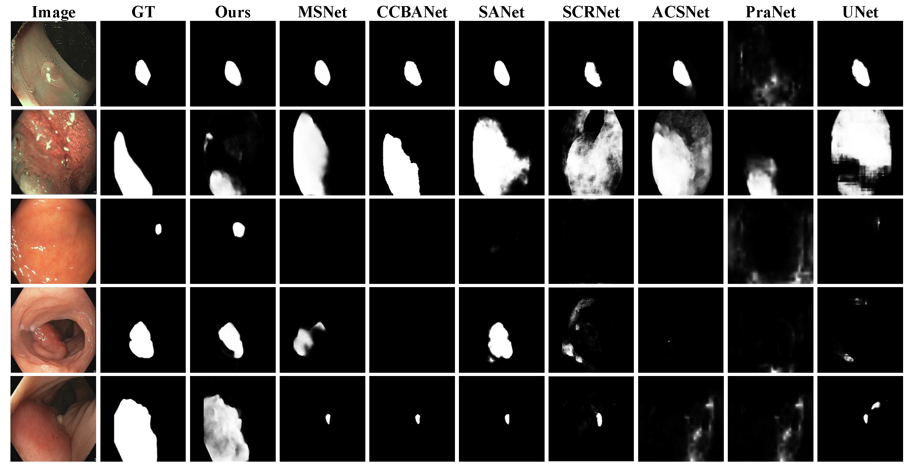

# Semantic Memory Guided Image Representation for Polyp Segmentation (ICASSP-2023)

## Introduction

The repository contains the PyTorch implementation of **"Semantic Memory Guided Image Representation for Polyp Segmentation"**

## Overview

####  1. Framework

      
    <em> 
    Figure 1: Overview of our proposed DCRNet
    </em>

####  2. Quantitative Results

<table style="border-collapse: collapse; border: none; border-spacing: 0px;" align="center">
	<caption>
		Quantitative results on three benchmarks
	</caption>
	<tr>
		<td rowspan="2" style="background-color: rgb(239, 239, 239); border-right: 1px solid black; border-top: 1px solid black; border-bottom: 1px solid black; text-align: right; padding-right: 3pt; padding-left: 3pt;">
			Method
		</td>
		<td rowspan="2" style="background-color: rgb(239, 239, 239); border-right: 1px solid black; border-top: 1px solid black; border-bottom: 1px solid black; text-align: center; padding-right: 3pt; padding-left: 3pt;">
			Year
		</td>
		<td colspan="3" style="background-color: rgb(239, 239, 239); border-right: 1px solid black; border-top: 1px solid black; text-align: center; padding-right: 3pt; padding-left: 3pt;">
			EndoScene
		</td>
		<td colspan="3" style="background-color: rgb(239, 239, 239); border-right: 1px solid black; border-top: 1px solid black; text-align: center; padding-right: 3pt; padding-left: 3pt;">
			Kvasir-SEG
		</td>
		<td colspan="3" style="background-color: rgb(239, 239, 239); border-top: 1px solid black; text-align: center; padding-right: 3pt; padding-left: 3pt;">
			PICCOLO
		</td>
	</tr>
	<tr>
		<td style="background-color: rgb(239, 239, 239); border-bottom: 1px solid black; text-align: center; padding-right: 3pt; padding-left: 3pt;">
			MAE
		</td>
		<td style="background-color: rgb(239, 239, 239); border-bottom: 1px solid black; text-align: center; padding-right: 3pt; padding-left: 3pt;">
			Dice
		</td>
		<td style="background-color: rgb(239, 239, 239); border-right: 1px solid black; border-bottom: 1px solid black; text-align: center; padding-right: 3pt; padding-left: 3pt;">
			IoU
		</td>
		<td style="background-color: rgb(239, 239, 239); border-bottom: 1px solid black; text-align: center; padding-right: 3pt; padding-left: 3pt;">
			MAE
		</td>
		<td style="background-color: rgb(239, 239, 239); border-bottom: 1px solid black; text-align: center; padding-right: 3pt; padding-left: 3pt;">
			Dice
		</td>
		<td style="background-color: rgb(239, 239, 239); border-right: 1px solid black; border-bottom: 1px solid black; text-align: center; padding-right: 3pt; padding-left: 3pt;">
			IoU
		</td>
		<td style="background-color: rgb(239, 239, 239); border-bottom: 1px solid black; text-align: center; padding-right: 3pt; padding-left: 3pt;">
			MAE
		</td>
		<td style="background-color: rgb(239, 239, 239); border-bottom: 1px solid black; text-align: center; padding-right: 3pt; padding-left: 3pt;">
			Dice
		</td>
		<td style="background-color: rgb(239, 239, 239); border-bottom: 1px solid black; text-align: center; padding-right: 3pt; padding-left: 3pt;">
			IoU
		</td>
	</tr>
	<tr>
		<td style="border-right: 1px solid black; text-align: right; padding-right: 3pt; padding-left: 3pt;">
			U-Net
		</td>
		<td style="border-right: 1px solid black; padding-right: 3pt; padding-left: 3pt;">
			2015
		</td>
		<td style="text-align: center; padding-right: 3pt; padding-left: 3pt;">
			4.4
		</td>
		<td style="text-align: center; padding-right: 3pt; padding-left: 3pt;">
			73.78
		</td>
		<td style="border-right: 1px solid black; text-align: center; padding-right: 3pt; padding-left: 3pt;">
			66.54
		</td>
		<td style="text-align: center; padding-right: 3pt; padding-left: 3pt;">
			4.2
		</td>
		<td style="text-align: center; padding-right: 3pt; padding-left: 3pt;">
			85.97
		</td>
		<td style="border-right: 1px solid black; text-align: center; padding-right: 3pt; padding-left: 3pt;">
			78.70
		</td>
		<td style="text-align: center; padding-right: 3pt; padding-left: 3pt;">
			5.0
		</td>
		<td style="text-align: center; padding-right: 3pt; padding-left: 3pt;">
			66.81
		</td>
		<td style="text-align: center; padding-right: 3pt; padding-left: 3pt;">
			60.59
		</td>
	</tr>
	<tr>
		<td style="border-right: 1px solid black; text-align: right; padding-right: 3pt; padding-left: 3pt;">
			PraNet
		</td>
		<td style="border-right: 1px solid black; padding-right: 3pt; padding-left: 3pt;">
			2020
		</td>
		<td style="text-align: center; padding-right: 3pt; padding-left: 3pt;">
			3.5
		</td>
		<td style="text-align: center; padding-right: 3pt; padding-left: 3pt;">
			81.73
		</td>
		<td style="border-right: 1px solid black; text-align: center; padding-right: 3pt; padding-left: 3pt;">
			74.38
		</td>
		<td style="text-align: center; padding-right: 3pt; padding-left: 3pt;">
			<b>3.1</b>
		</td>
		<td style="text-align: center; padding-right: 3pt; padding-left: 3pt;">
			89.20
		</td>
		<td style="border-right: 1px solid black; text-align: center; padding-right: 3pt; padding-left: 3pt;">
			83.61
		</td>
		<td style="text-align: center; padding-right: 3pt; padding-left: 3pt;">
			3.0
		</td>
		<td style="text-align: center; padding-right: 3pt; padding-left: 3pt;">
			75.34
		</td>
		<td style="text-align: center; padding-right: 3pt; padding-left: 3pt;">
			69.77
		</td>
	</tr>
	<tr>
		<td style="border-right: 1px solid black; text-align: right; padding-right: 3pt; padding-left: 3pt;">
			ACSNet
		</td>
		<td style="border-right: 1px solid black; padding-right: 3pt; padding-left: 3pt;">
			2020
		</td>
		<td style="text-align: center; padding-right: 3pt; padding-left: 3pt;">
			3.0
		</td>
		<td style="text-align: center; padding-right: 3pt; padding-left: 3pt;">
			85.15
		</td>
		<td style="border-right: 1px solid black; text-align: center; padding-right: 3pt; padding-left: 3pt;">
			78.67
		</td>
		<td style="text-align: center; padding-right: 3pt; padding-left: 3pt;">
			3.2
		</td>
		<td style="text-align: center; padding-right: 3pt; padding-left: 3pt;">
			89.32
		</td>
		<td style="border-right: 1px solid black; text-align: center; padding-right: 3pt; padding-left: 3pt;">
			83.83
		</td>
		<td style="text-align: center; padding-right: 3pt; padding-left: 3pt;">
			<b>2.2</b>
		</td>
		<td style="text-align: center; padding-right: 3pt; padding-left: 3pt;">
			79.08
		</td>
		<td style="text-align: center; padding-right: 3pt; padding-left: 3pt;">
			74.82
		</td>
	</tr>
	<tr>
		<td style="border-right: 1px solid black; text-align: right; padding-right: 3pt; padding-left: 3pt;">
			SCRNet
		</td>
		<td style="border-right: 1px solid black; padding-right: 3pt; padding-left: 3pt;">
			2021
		</td>
		<td style="text-align: center; padding-right: 3pt; padding-left: 3pt;">
			<b>2.9</b>
		</td>
		<td style="text-align: center; padding-right: 3pt; padding-left: 3pt;">
			85.29
		</td>
		<td style="border-right: 1px solid black; text-align: center; padding-right: 3pt; padding-left: 3pt;">
			78.81
		</td>
		<td style="text-align: center; padding-right: 3pt; padding-left: 3pt;">
			3.6
		</td>
		<td style="text-align: center; padding-right: 3pt; padding-left: 3pt;">
			88.62
		</td>
		<td style="border-right: 1px solid black; text-align: center; padding-right: 3pt; padding-left: 3pt;">
			82.52
		</td>
		<td style="text-align: center; padding-right: 3pt; padding-left: 3pt;">
			3.0
		</td>
		<td style="text-align: center; padding-right: 3pt; padding-left: 3pt;">
			78.51
		</td>
		<td style="text-align: center; padding-right: 3pt; padding-left: 3pt;">
			72.74
		</td>
	</tr>
	<tr>
		<td style="border-right: 1px solid black; text-align: right; padding-right: 3pt; padding-left: 3pt;">
			SANet
		</td>
		<td style="border-right: 1px solid black; padding-right: 3pt; padding-left: 3pt;">
			2021
		</td>
		<td style="text-align: center; padding-right: 3pt; padding-left: 3pt;">
			3.1
		</td>
		<td style="text-align: center; padding-right: 3pt; padding-left: 3pt;">
			84.15
		</td>
		<td style="border-right: 1px solid black; text-align: center; padding-right: 3pt; padding-left: 3pt;">
			77.21
		</td>
		<td style="text-align: center; padding-right: 3pt; padding-left: 3pt;">
			<b>3.1</b>
		</td>
		<td style="text-align: center; padding-right: 3pt; padding-left: 3pt;">
			89.86
		</td>
		<td style="border-right: 1px solid black; text-align: center; padding-right: 3pt; padding-left: 3pt;">
			79.04
		</td>
		<td style="text-align: center; padding-right: 3pt; padding-left: 3pt;">
			3.6
		</td>
		<td style="text-align: center; padding-right: 3pt; padding-left: 3pt;">
			79.08
		</td>
		<td style="text-align: center; padding-right: 3pt; padding-left: 3pt;">
			73.04
		</td>
	</tr>
	<tr>
		<td style="border-right: 1px solid black; text-align: right; padding-right: 3pt; padding-left: 3pt;">
			CCBANet
		</td>
		<td style="border-right: 1px solid black; padding-right: 3pt; padding-left: 3pt;">
			2021
		</td>
		<td style="text-align: center; padding-right: 3pt; padding-left: 3pt;">
			3.4
		</td>
		<td style="text-align: center; padding-right: 3pt; padding-left: 3pt;">
			83.85
		</td>
		<td style="border-right: 1px solid black; text-align: center; padding-right: 3pt; padding-left: 3pt;">
			76.52
		</td>
		<td style="text-align: center; padding-right: 3pt; padding-left: 3pt;">
			<b>3.1</b>
		</td>
		<td style="text-align: center; padding-right: 3pt; padding-left: 3pt;">
			89.43
		</td>
		<td style="border-right: 1px solid black; text-align: center; padding-right: 3pt; padding-left: 3pt;">
			83.41
		</td>
		<td style="text-align: center; padding-right: 3pt; padding-left: 3pt;">
			2.8
		</td>
		<td style="text-align: center; padding-right: 3pt; padding-left: 3pt;">
			76.22
		</td>
		<td style="text-align: center; padding-right: 3pt; padding-left: 3pt;">
			71.64
		</td>
	</tr>
	<tr>
		<td style="border-right: 1px solid black; text-align: right; padding-right: 3pt; padding-left: 3pt;">
			MSNet
		</td>
		<td style="border-right: 1px solid black; padding-right: 3pt; padding-left: 3pt;">
			2021
		</td>
		<td style="text-align: center; padding-right: 3pt; padding-left: 3pt;">
			3.6
		</td>
		<td style="text-align: center; padding-right: 3pt; padding-left: 3pt;">
			80.82
		</td>
		<td style="border-right: 1px solid black; text-align: center; padding-right: 3pt; padding-left: 3pt;">
			74.49
		</td>
		<td style="text-align: center; padding-right: 3pt; padding-left: 3pt;">
			3.4
		</td>
		<td style="text-align: center; padding-right: 3pt; padding-left: 3pt;">
			89.03
		</td>
		<td style="border-right: 1px solid black; text-align: center; padding-right: 3pt; padding-left: 3pt;">
			83.08
		</td>
		<td style="text-align: center; padding-right: 3pt; padding-left: 3pt;">
			3.2
		</td>
		<td style="text-align: center; padding-right: 3pt; padding-left: 3pt;">
			81.37
		</td>
		<td style="text-align: center; padding-right: 3pt; padding-left: 3pt;">
			75.58
		</td>
	</tr>
	<tr>
		<td style="border-right: 1px solid black; border-bottom: 1px solid black; text-align: right; padding-right: 3pt; padding-left: 3pt;">
			Ours
		</td>
		<td style="border-right: 1px solid black; border-bottom: 1px solid black; padding-right: 3pt; padding-left: 3pt;">
			2022
		</td>
		<td style="border-bottom: 1px solid black; text-align: center; padding-right: 3pt; padding-left: 3pt;">
			<b>2.9</b>
		</td>
		<td style="border-bottom: 1px solid black; text-align: center; padding-right: 3pt; padding-left: 3pt;">
			<b>86.03</b>
		</td>
		<td style="border-right: 1px solid black; border-bottom: 1px solid black; text-align: center; padding-right: 3pt; padding-left: 3pt;">
			<b>79.34</b>
		</td>
		<td style="border-bottom: 1px solid black; text-align: center; padding-right: 3pt; padding-left: 3pt;">
			3.2
		</td>
		<td style="border-bottom: 1px solid black; text-align: center; padding-right: 3pt; padding-left: 3pt;">
			<b>89.92</b>
		</td>
		<td style="border-right: 1px solid black; border-bottom: 1px solid black; text-align: center; padding-right: 3pt; padding-left: 3pt;">
			<b>83.93</b>
		</td>
		<td style="border-bottom: 1px solid black; text-align: center; padding-right: 3pt; padding-left: 3pt;">
			2.8
		</td>
		<td style="border-bottom: 1px solid black; text-align: center; padding-right: 3pt; padding-left: 3pt;">
			<b>83.04</b>
		</td>
		<td style="border-bottom: 1px solid black; text-align: center; padding-right: 3pt; padding-left: 3pt;">
			<b>76.78</b>
		</td>
	</tr>
</table>

<!--  

      
    <em> 
    Figure 2: Quantitative results on EndoScene
    </em>

      
    <em> 
    Figure 3: Quantitative results on Kvasir-SEG
    </em>

-->

####  3. Qualitative Results

      
    <em> 
    Figure 2: Qualitative results of different methods on PICCOLO.
    </em>

## Usage

#### 1. Prerequisite environment

1. **torch>=1.5.0**
2. **torchvision>=0.6.0**

3. tqdm

4. scipy

5. scikit-image

6. PIL

7. numpy

8. CUDA

#### 2. Dataset downloading

- Downloading the CVC-EndoSceneStill dataset, which can be found in this [Google Drive link](https://drive.google.com/file/d/1MuO2SbGgOL_jdBu3ffSf92feBtj8pbnw/view?usp=sharing)
- Downloading the Kvasir-SEG dataset, which can be found in this [Google Drive link](https://drive.google.com/file/d/1S9aV_CkvJcsouRN4zvjtyL1vDhBkGRqA/view?usp=sharing)
- To access the PICCOLO dataset, please visit [here](https://www.biobancovasco.org/en/Sample-and-data-catalog/Databases/PD178-PICCOLO-EN.html)

#### 3. Train

- Assign your customized path of `--train_path ` ,`--save_root` and `--gpu` in `Train.py`.
- Run `python Train.py `

#### 4. Test

- Assign the `--pth_path ` ,  `--data_root` ,  `--save_root` and `--gpu` in `Test.py`.
- Run `python Test.py `
- The quantitative results will be displayed in your screen, and the qualitative results will be saved in your customized path.

#### 5. Evaluate

- The evaluation code is stored in ./utils/eval.py
- You can replace it with your customized evaluation metrics.
